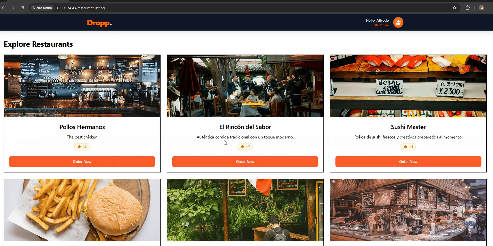
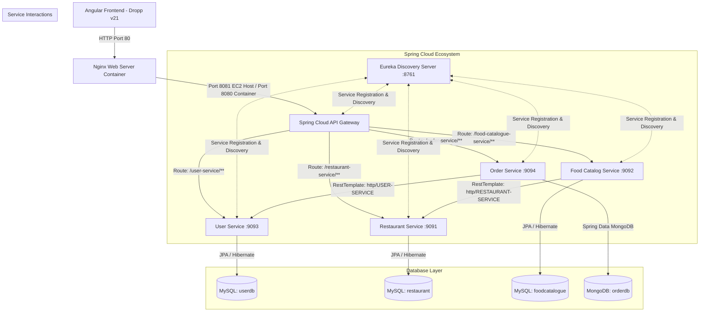
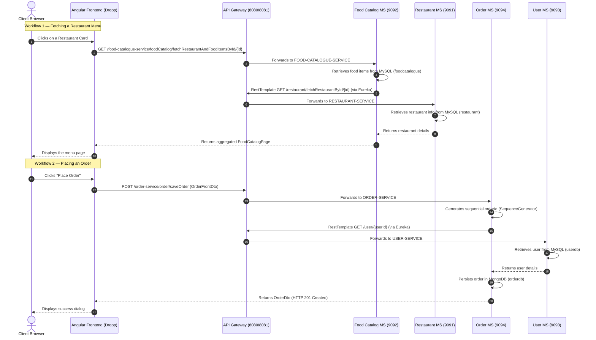
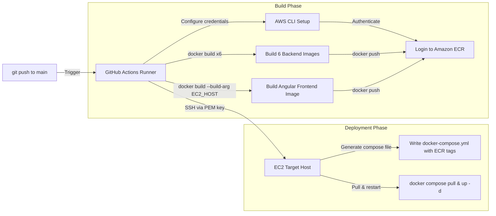

# Dropp — Cloud-Native Food Delivery Platform

[](https://spring.io/projects/spring-boot)
[](https://spring.io/projects/spring-cloud)
[](https://angular.dev/)
[](https://www.docker.com/)
[](https://sonarcloud.io/summary/new_code?id=manuelvm33_Dropp-Microservices-Food-Delivery-Platform)
[](https://aws.amazon.com/)
[](LICENSE)

**Dropp** is a production-ready, cloud-native food delivery platform built on a fully decoupled microservices architecture. The backend runs on **Spring Boot 3.5.x** and **Spring Cloud**, coordinated via **Eureka Service Discovery** and a **Spring Cloud API Gateway**. The frontend is a modern **Angular 21** single-page application styled with **Tailwind CSS 4**, offering a smooth restaurant browsing, menu exploration, and cart checkout experience.

---

## 🎬 Demo

[](docs/demo.mp4)
> End-to-end walkthrough: restaurant browsing, menu selection, cart checkout, and order persistence in MongoDB Atlas.
 
## 📋 Table of Contents

- [Dropp — Cloud-Native Food Delivery Platform](#dropp--cloud-native-food-delivery-platform)
  - [🎬 Demo](#-demo)
  - [📋 Table of Contents](#-table-of-contents)
  - [🏗️ Architecture](#️-architecture)
    - [System Architecture](#system-architecture)
    - [End-to-End Workflow](#end-to-end-workflow)
  - [📂 Repository Structure](#-repository-structure)
  - [🛠️ Tech Stack](#️-tech-stack)
    - [Backend](#backend)
    - [Frontend](#frontend)
    - [DevOps \& Cloud](#devops--cloud)
  - [📡 Services Overview](#-services-overview)
    - [Microservice Reference](#microservice-reference)
    - [API Endpoints](#api-endpoints)
  - [🔒 Environment Variables \& Credentials](#-environment-variables--credentials)
    - [AWS Parameter Store Keys](#aws-parameter-store-keys)
    - [GitHub Actions Secrets (CD Pipeline)](#github-actions-secrets-cd-pipeline)
  - [💻 Local Development](#-local-development)
    - [Prerequisites](#prerequisites)
    - [Step 1 — Set Up Databases](#step-1--set-up-databases)
    - [Step 2 — Start the Backend Services](#step-2--start-the-backend-services)
    - [Step 3 — Start the Angular Frontend](#step-3--start-the-angular-frontend)
  - [🐳 Docker Usage](#-docker-usage)
  - [🧪 Testing \& Code Quality](#-testing--code-quality)
    - [Backend](#backend-1)
    - [Frontend](#frontend-1)
  - [🚀 CI/CD \& Deployment](#-cicd--deployment)
    - [Pipeline Overview](#pipeline-overview)
    - [What Happens on Each Push](#what-happens-on-each-push)
  - [🔍 Troubleshooting](#-troubleshooting)
  - [🔮 Future Improvements](#-future-improvements)
  - [📄 License](#-license)

---

## 🏗️ Architecture

Dropp follows the **database-per-service** pattern, where each microservice owns its own storage engine. This promotes true domain isolation, independent deployability, and clear ownership boundaries.

### System Architecture



### End-to-End Workflow

The sequence below illustrates the two primary user workflows: **fetching a restaurant menu** and **placing an order**.



---

## 📂 Repository Structure

```text
.
├── .github/
│   └── workflows/
│       └── deploy.yml                  # GitHub Actions CD pipeline
├── backend/
│   ├── api-gateway/                    # Spring Cloud API Gateway          (Port 8080)
│   ├── eureka-server/                  # Eureka Service Registry            (Port 8761)
│   ├── food-catalog-service/           # Food item & menu management        (Port 9092)
│   ├── order-service/                  # Order aggregation & persistence    (Port 9094)
│   ├── restaurant-listing-service/     # Restaurant metadata & directory    (Port 9091)
│   └── user-service/                   # User identity & registry           (Port 9093)
├── frontend/
│   └── dropp/                          # Angular 21 frontend client
│       ├── src/
│       │   ├── app/
│       │   │   ├── core/               # Singleton API services
│       │   │   ├── features/           # Routed views (Restaurants, Menu, Checkout)
│       │   │   └── shared/             # Reusable components and schemas
│       │   └── environments/           # Environment configs (local vs. production)
│       ├── Dockerfile                  # Multi-stage Angular Docker build
│       └── package.json                # Pnpm scripts, Tailwind & Vitest config
├── docker-compose.local.yml            # Local Docker orchestration
├── docker-compose.yml                  # Production (ECR) Docker Compose manifest
└── README.md
```

---

## 🛠️ Tech Stack

### Backend

| Category | Technology |
| :--- | :--- |
| **Core Language & Framework** | Java 21, Spring Boot `3.5.x` |
| **Microservices & Routing** | Spring Cloud `2025.0.0` — Eureka Server, API Gateway |
| **Data Access** | Spring Data JPA (Hibernate), Spring Data MongoDB, `mysql-connector-j` |
| **Cloud Config** | AWS Parameter Store via `spring-cloud-aws-starter-parameter-store` |
| **Utilities** | MapStruct `1.6.3`, Lombok |
| **Testing & Quality** | JUnit 5, Mockito, JaCoCo, SonarQube Scanner |

### Frontend

| Category | Technology |
| :--- | :--- |
| **Framework** | Angular `21.2.x` — Standalone components, Signals, `inject` API |
| **Styling** | Tailwind CSS `4.2.x`, PostCSS |
| **Testing** | Vitest `4.0.x`, JSDOM, Angular TestBed |
| **Package Manager** | Pnpm `10.20.0` |
| **Static Serving** | Nginx Alpine (containerized reverse proxy) |

### DevOps & Cloud

| Category | Technology |
| :--- | :--- |
| **Containerization** | Docker, Docker Compose |
| **CI/CD** | GitHub Actions |
| **Cloud Target** | AWS EC2, Amazon ECR |

---

## 📡 Services Overview

### Microservice Reference

| Service | Local Port | EC2 Port | Database | Notes |
| :--- | :---: | :---: | :---: | :--- |
| **`eureka-server`** | `8761` | `8761` | *(In-Memory)* | Core discovery server. Exposes `/actuator/health` for readiness checks. |
| **`api-gateway`** | `8080` | `8081` | *(None)* | Reactive WebFlux gateway. Auto-discovers Eureka registrants. CORS configured for all origins. |
| **`restaurant-listing-service`** | `9091` | *(internal)* | MySQL (`restaurant`) | CRUD endpoints for restaurant metadata. Supports JPA pagination. Registers as `RESTAURANT-SERVICE`. |
| **`food-catalog-service`** | `9092` | *(internal)* | MySQL (`foodcatalogue`) | Aggregates food items with restaurant data via load-balanced `RestTemplate`. Registers as `FOOD-CATALOGUE-SERVICE`. |
| **`user-service`** | `9093` | *(internal)* | MySQL (`userdb`) | User identity and retrieval by numeric ID. Registers as `USER-SERVICE`. |
| **`order-service`** | `9094` | *(internal)* | MongoDB (`orderdb`) | High-throughput order persistence with auto-incrementing IDs via `SequenceGenerator`. Registers as `ORDER-SERVICE`. |

### API Endpoints

<details>
<summary><strong>User Service</strong></summary>

| Method | Endpoint | Description |
| :--- | :--- | :--- |
| `POST` | `/user/addUser` | Registers a new user |
| `GET` | `/user/{userId}` | Fetches details for a specific user |

</details>

<details>
<summary><strong>Restaurant Listing Service</strong></summary>

| Method | Endpoint | Description |
| :--- | :--- | :--- |
| `POST` | `/restaurant/addRestaurant` | Creates a new restaurant entry |
| `GET` | `/restaurant/fetchRestaurantById/{id}` | Fetches metadata for a single restaurant |
| `GET` | `/restaurant/fetchRestaurants?page={page}&size={size}` | Returns a paginated list of restaurants |

</details>

<details>
<summary><strong>Food Catalog Service</strong></summary>

| Method | Endpoint | Description |
| :--- | :--- | :--- |
| `POST` | `/foodCatalog/addFoodItem` | Associates a food item with a restaurant |
| `GET` | `/foodCatalog/fetchRestaurantAndFoodItemsById/{restaurantId}` | Returns combined menu and restaurant metadata |

</details>

<details>
<summary><strong>Order Service</strong></summary>

| Method | Endpoint | Description |
| :--- | :--- | :--- |
| `POST` | `/order/saveOrder` | Validates user context, aggregates order lines, assigns a sequential ID, and persists to MongoDB |

</details>

---

## 🔒 Environment Variables & Credentials

Dropp uses Spring profiles to separate local and production configurations cleanly.

- **Locally**, services run with `SPRING_PROFILES_ACTIVE=local`, reading from `application-local.yml`.
- **In production**, `SPRING_PROFILES_ACTIVE=prod` activates AWS Parameter Store imports from the prefix `/dropp/prod/`.

### AWS Parameter Store Keys

| Key | Description |
| :--- | :--- |
| `mysql-user-url` | JDBC endpoint for the user MySQL instance |
| `mysql-restaurant-url` | JDBC endpoint for the restaurant MySQL instance |
| `mysql-foodcatalog-url` | JDBC endpoint for the food catalog MySQL instance |
| `mysql-user` | Database root username |
| `mysql-pass` | Database password |
| `mongo-uri` | MongoDB connection URI (e.g. `mongodb://host:port/orderdb`) |
| `eureka-url` | Full Eureka registration URL (e.g. `http://eureka:8761/eureka/`) |

### GitHub Actions Secrets (CD Pipeline)

| Secret | Description |
| :--- | :--- |
| `AWS_ACCESS_KEY_ID` | AWS IAM access key |
| `AWS_SECRET_ACCESS_KEY` | AWS IAM secret key |
| `ECR_REGISTRY` | Amazon ECR root path (e.g. `ACCOUNT_ID.dkr.ecr.us-east-1.amazonaws.com`) |
| `EC2_HOST` | Elastic IP or hostname of the deployment EC2 instance |
| `EC2_SSH_KEY` | PEM private key for SSH authentication with the EC2 host |

---

## 💻 Local Development

Follow these steps to run the full Dropp stack on your local machine.

### Prerequisites

Make sure you have the following installed before proceeding:

- **Java 21** configured in your system `PATH`
- **Node.js v22+** and **Pnpm 10.20.0+**
- **MySQL** running on port **`3307`** with credentials `root` / `asdf1234$`
- **MongoDB** running on port **`27017`**

> **Why port 3307?** Dropp's local config uses `3307` to avoid conflicts with any existing MySQL instance running on the default `3306`.

### Step 1 — Set Up Databases

Connect to your local MySQL server on port `3307` and create the required schemas:

```sql
CREATE DATABASE userdb;
CREATE DATABASE restaurant;
CREATE DATABASE foodcatalogue;
```

### Step 2 — Start the Backend Services

Launch services in the order below. Open a separate terminal window for each.

**1. Eureka Server** *(start this first)*
```bash
cd backend/eureka-server
./mvnw spring-boot:run -Dspring-boot.run.profiles=local
```

**2. API Gateway**
```bash
cd backend/api-gateway
./mvnw spring-boot:run -Dspring-boot.run.profiles=local
```

**3. Domain Microservices** *(order doesn't matter here)*
```bash
# User Service
cd backend/user-service
./mvnw spring-boot:run -Dspring-boot.run.profiles=local

# Restaurant Service
cd backend/restaurant-listing-service
./mvnw spring-boot:run -Dspring-boot.run.profiles=local

# Food Catalog Service
cd backend/food-catalog-service
./mvnw spring-boot:run -Dspring-boot.run.profiles=local

# Order Service
cd backend/order-service
./mvnw spring-boot:run -Dspring-boot.run.profiles=local
```

### Step 3 — Start the Angular Frontend

```bash
cd frontend/dropp
pnpm install
pnpm run start
```

The app will be available at **[http://localhost:4200](http://localhost:4200)**.

---

## 🐳 Docker Usage

To spin up the entire stack using Docker, use the local Compose file, which builds each image directly from source.

```bash
docker compose -f docker-compose.local.yml up --build
```

This starts all six backend services plus the Angular frontend behind Nginx. The following ports are exposed on your host:

| Container | Host Port |
| :--- | :---: |
| Eureka Server | `8761` |
| API Gateway | `8080` |
| Frontend (Nginx) | `80` |

> **Note:** Ensure your local MySQL and MongoDB instances are reachable from the Docker bridge network. You may need to adjust host references inside `docker-compose.local.yml` (e.g., use `host.docker.internal` on macOS/Windows or the host's bridge IP on Linux).

---

## 🧪 Testing & Code Quality

Dropp maintains high standards for reliability and code health throughout the entire backend and frontend codebase.

### Backend

**Unit Testing with JUnit 5**

All microservices include a comprehensive JUnit 5 test suite located under `src/test/java`. Tests are written alongside **Mockito** for clean dependency isolation, covering service logic, repository interactions, and REST controller behavior.

```bash
# Run tests for any individual microservice
cd backend/<service-name>
./mvnw clean test
```

**Code Coverage with JaCoCo**

JaCoCo is integrated into each Maven build to measure and enforce code coverage thresholds. Detailed HTML reports are generated under `target/site/jacoco/` after each run.

```bash
# Run tests and generate coverage report
./mvnw clean test verify
```

Open `target/site/jacoco/index.html` in your browser to inspect coverage results per class and method.

**Continuous Code Quality with SonarQube**

Dropp uses **SonarQube** to continuously analyze code quality across all microservices. SonarQube scans are executed via the `sonar-maven-plugin` and cover:

- Code smells and maintainability issues
- Bug and vulnerability detection
- Duplication analysis
- Test coverage gate enforcement

```bash
# Run a SonarQube analysis (requires a running SonarQube server or SonarCloud token)
./mvnw verify sonar:sonar \
  -Dsonar.projectKey=<your-project-key> \
  -Dsonar.host.url=<your-sonar-url> \
  -Dsonar.login=<your-sonar-token>
```
Each microservice is analyzed via **SonarCloud** on every push to `main`, scanning for code smells, bugs, vulnerabilities, and duplication. The quality gate enforces that no new issues are introduced before a deployment proceeds.

| Service | Quality Gate | Coverage |
| :--- | :--- | :--- |
| User Service | [](https://sonarcloud.io/organizations/manuelvm33/projects) |  |
| Restaurant Service | [](https://sonarcloud.io/organizations/manuelvm33/projects) |  |
| Food Catalog Service | [](https://sonarcloud.io/organizations/manuelvm33/projects) |  |
| Order Service | [](https://sonarcloud.io/organizations/manuelvm33/projects) |  |

> Coverage figures are measured locally via JaCoCo. Click the JaCoCo badge at the top of this file to view the full report screenshot.
### Frontend

**Unit Tests with Vitest**

The Angular client uses **Vitest** with JSDOM and Angular `TestBed` for component and service testing. The test suite runs fast with near-instant hot reloads during development.

```bash
cd frontend/dropp
pnpm run test
```

---

## 🚀 CI/CD & Deployment

Dropp ships with a complete Continuous Deployment pipeline powered by **GitHub Actions**. Every push to the `main` branch automatically builds, packages, and deploys the entire platform to AWS.

### Pipeline Overview



### What Happens on Each Push

1. **Build** — The GitHub runner compiles Docker images for all six backend services.
2. **Frontend Injection** — The Angular `Dockerfile` receives `EC2_HOST` as a `--build-arg`, so the built Nginx image points directly to the production API Gateway at `http://$EC2_HOST:8081`.
3. **Push to ECR** — All images are pushed to Amazon ECR repositories with versioned tags.
4. **Remote Deployment** — The runner SSHes into the EC2 instance, writes a fresh `docker-compose.yml` with the latest ECR image references, then performs a clean rolling restart:
   ```bash
   docker compose down && docker compose pull && docker compose up -d --remove-orphans
   ```

---

## 🔍 Troubleshooting

**Eureka registration failures**
> Ensure Eureka is fully initialized before starting domain services. Verify that `eureka.client.service-url.defaultZone` is set to `http://localhost:8761/eureka/` in local profiles.

**Port conflicts on MySQL**
> Dropp expects MySQL on port `3307` (not the default `3306`). Double-check your MySQL configuration allows connections on this port.

**404s through the API Gateway**
> Check that your service registers in Eureka using **ALL-CAPS** (e.g. `FOOD-CATALOGUE-SERVICE`) and that your request path uses the matching **lowercase** route prefix (e.g. `/food-catalogue-service/...`).

**CORS or unreachable API errors in the frontend**
> Verify that the API Gateway is exposed on port `8080` locally (or `8081` on EC2) and that no firewall rules are blocking the connection.

---

## 🔮 Future Improvements

- **Authentication & Authorization** — Add JWT-based auth with Spring Security OAuth2 filters at the gateway level.
- **Distributed Tracing** — Integrate Micrometer Tracing with Zipkin or Jaeger to trace requests across all microservices.
- **Kubernetes Support** — Introduce K8s manifests (Deployments, Services, Ingress) for elastic horizontal scaling.
- **Async Notifications** — Build a delivery tracking microservice powered by RabbitMQ or Apache Kafka for real-time order status updates.
- **Rate Limiting** — Add request throttling at the gateway layer to protect services from traffic spikes.

---

## 📄 License

Distributed under the [MIT License](LICENSE). Feel free to fork, build on, and share Dropp.